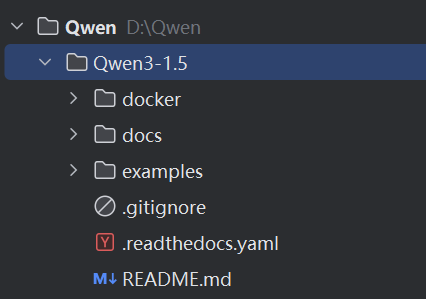
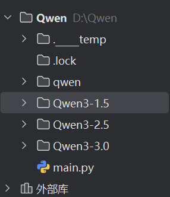
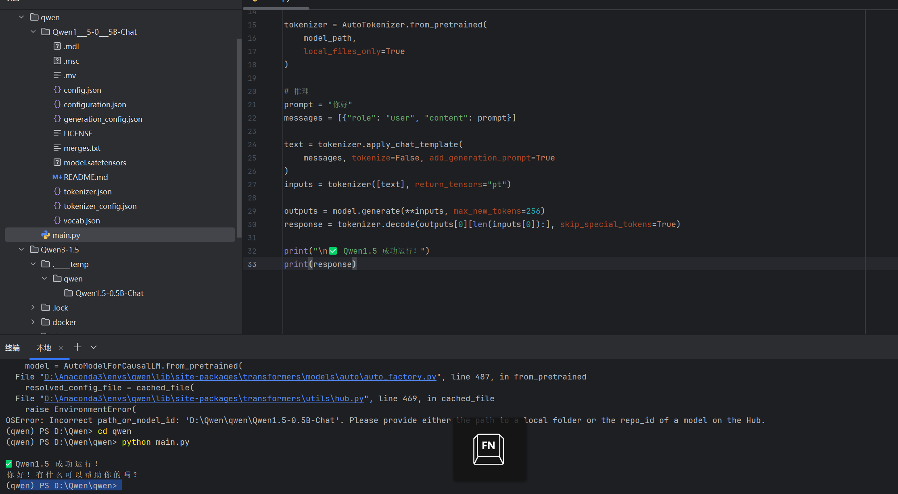
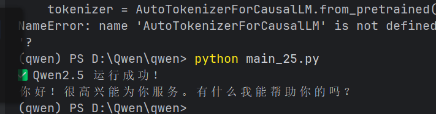
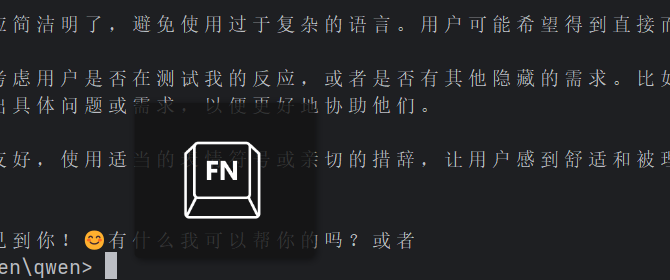
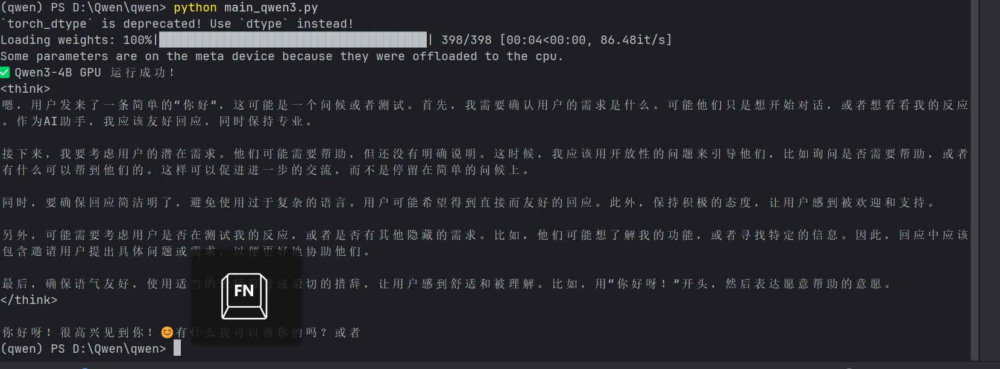
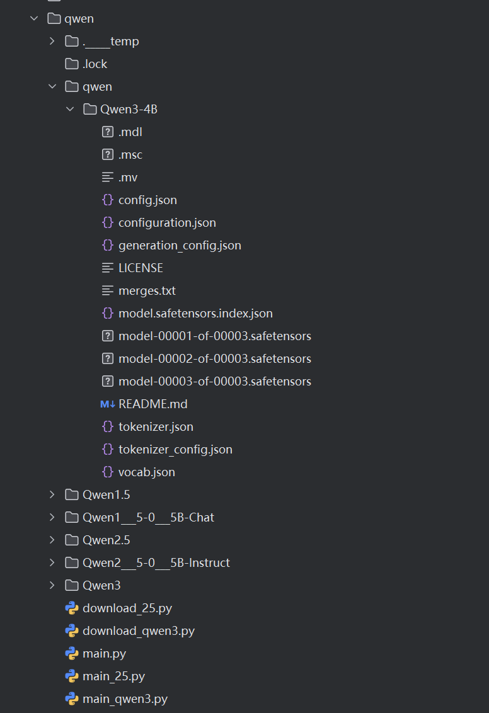
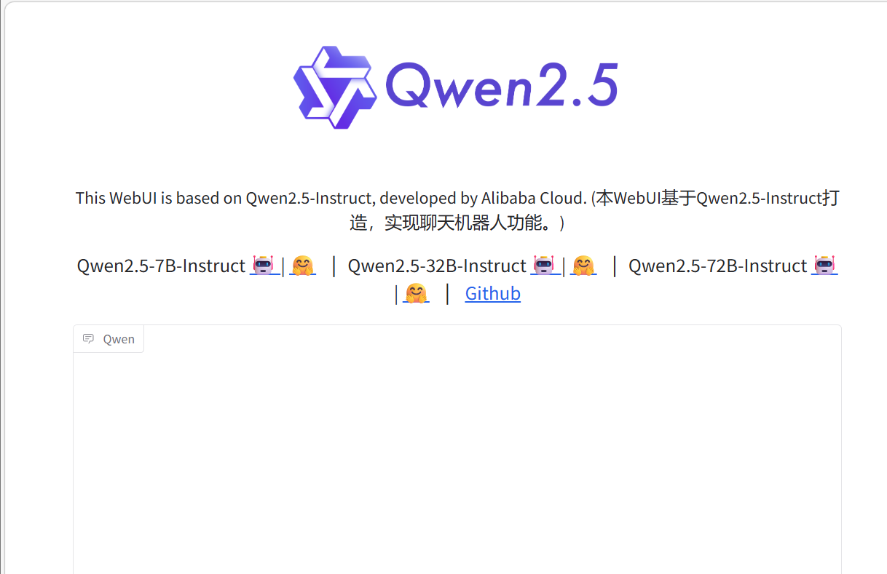
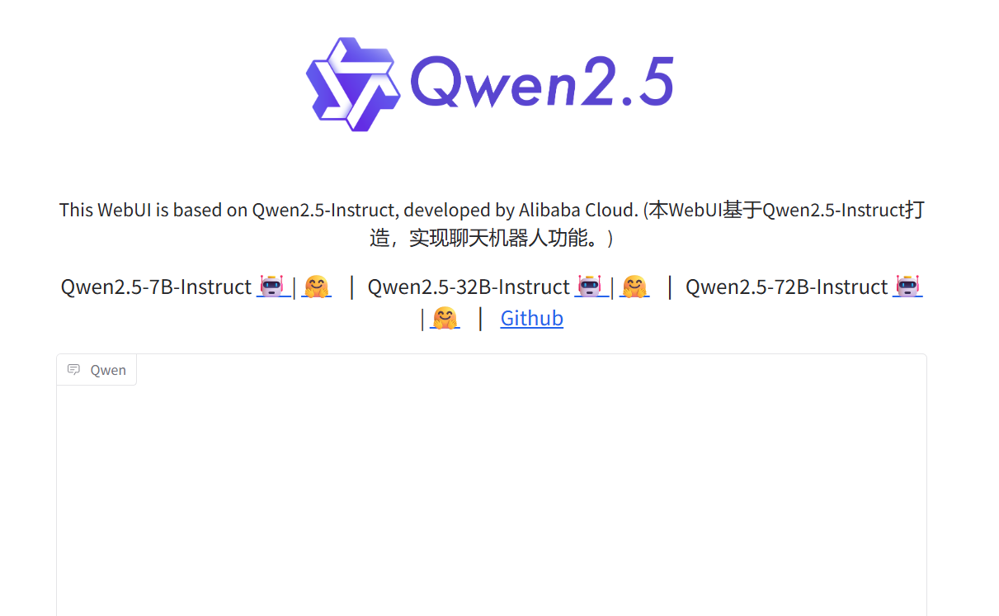
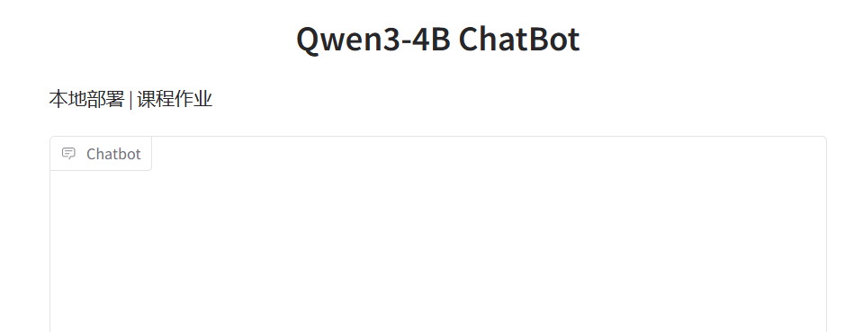

Qwen
作为开源大语言模型学习案例，考虑到不同学习者的硬件条件不同，决定使用Qwen1.5和2.5模型权重作为学习模型， 其参数量仅有5亿个参数，能在普通的个人电脑上运行。通过本案，可以学习到如何加载和使用一个大语言模型， 如何 使用大语言模型构建一个对话应用，以及了解一个ChatBot应用的构建逻辑等内容。

复现大模型语言
由于模型权重过大，无法上传到github，所以请自行下载模型权重。
本仓库中提供了Qwen1.5、2.5和Qwen3.0的web_demo.py文件，该文件是模型权重加载的代码， 可以打开页面，并在本地浏览器中输入问题，即可得到答案。 下面介绍如何进行复现：

准备安装环境
首先安装Python环境，建议使用Anaconda。
然后根据自己的电脑配置安装CUDA、CUDNN和Pytorch。
本机电脑环境配置  
torch==2.5.1+cu121  
transformers==4.57.6  
accelerate==1.10.0  
gradio==3.50.2  
safetensors==0.6.2  
tokenizers==0.22.2  
注意:请不要装最新的gradio，会报错，请使用3.50.2版本。

模型权重下载
模型权重下载地址：使用modelscope这个网站搜索Qwen模型，下载对应的模型权重。 该代码在安装模型.py中，其代码如下：

from modelscope import snapshot_download
model_dir = snapshot_download('qwen/Qwen1.5-0.5B-Chat',
cache_dir='D:\code_study_program\code\pycharm\github_program\-Qwen-\qwenmodel\Qwen3-1.5\model')

from modelscope import snapshot_download
model_dir = snapshot_download('qwen/Qwen2.5-0.5B-Instruct',
cache_dir='D:\code_study_program\code\pycharm\github_program\-Qwen-\qwenmodel\Qwen3-2.5\model')#cache_dir='./'为指定下载目录，不然会下载到C盘的缓存中

from modelscope import snapshot_download
model_dir = snapshot_download('Qwen/Qwen3-0.6B',
cache_dir='D:\code_study_program\code\pycharm\github_program\-Qwen-\qwenmodel\Qwen3-3.0\model')#cache_dir='./'为指定下载目录，不然会下载到C盘的缓存中
分别下载Qwen1.5、2.5和3的模型权重，并保存到指定的目录中。
实验过程及结果：
先分别跑了Qwen1.5，Qwen2.5，以及Qwen3
过程及结果：

web_demo如下：

因为1.5未修改直接使用的2.5的模板，所以显示的为2.5
Qwen3则是下载web——demo失败使用ai编写的网页机器人

